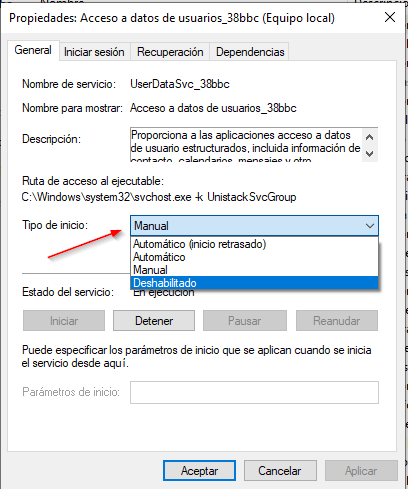

# Proyecto 3 Bastionado

author: Pablo Painceiras Martínez, David Vila Diaz y Carlos Montesino Fernando
summary: Hardening Windows
id: Proyecto 3 Windows
categories: codelab,markdown

## Introducción

En esta guía vamos a configurar un Windows 10 para que tenga lo necesario para un equipo dedicado a navegación web y ofimática básica

Antes de empezar con el hardering, hemos instalado un Windows 10 Home, básico, en donde no hemos realizado la instalación básica sin añadir ningún complemento que nos ofrecía.

## Aplicaciones

Para un equipo destinado principalmente a navegación web y ofimática básica, hay varias aplicaciones base de Windows 10 que son indispensables y que proporcionan las funcionalidades necesarias para estas tareas.

1. **Navegador web:** Utiliza Microsoft Edge, Google Chrome o Mozilla Firefox para la navegación web.
2. **Suite de oficina:** Microsoft Office, LibreOffice o Google Workspace. Estas suites incluyen aplicaciones como procesadores de texto, hojas de cálculo y programas de presentación.
3. **Cliente de correo electrónico:** Usa la aplicación Correo para gestionar tus correos electrónicos. 
4. **Lector de PDF:** Windows incluye Microsoft Edge como lector de PDF integrado.
5. **Antivirus y seguridad:** Asegúrate de tener un programa antivirus instalado para proteger tu equipo. Windows Defender es una opción integrada en Windows 10 y ofrece una protección sólida. 
6. **Explorador de archivos:** Utiliza el Explorador de archivos de Windows para gestionar y organizar tus archivos y carpetas.
7. **Calendario y Recordatorios:** Usa la aplicación Calendario para gestionar tus eventos y citas.

Para poder ver las aplicaciones que tenemos instaladas nos iremos al apartado de aplicaciones y características (Panel de control/Aplicaciones)

Una vez accedido, seleccionaremos las aplicaciones que no necesitamos y clicaremos en desinstalar.

### Lista de aplicaciones desinstaladas:

- Cámara
- Centro de opiniones
- Conexión a Escritorio remoto
- Contactos
- Cortana
- El tiempo
- Extensiones de multimedia web
- Grabadora de voz
- HEIF Image Extensions
- Mapas
- Paint
- Paint 3D
- Películas y TV
- Portal de realidad mixta
- Reproductor multimedia
- Skype
- Solitaire & Casual Games
- Visor 3D
- Webp Image Extensions
- Xbox Console Companion
- Xbox Live

## Protocolos

### Protocolos de red

- **Cliente para redes Microsoft:**
    - Activado. Este componente es esencial para la comunicación con redes basadas en tecnologías de Microsoft.
- **Uso compartido de archivos e impresoras para redes Microsoft:**
    - Activado si necesitas compartir archivos e impresoras en una red doméstica o de trabajo.
- **Programador de paquetes QoS:**
    - Desactivado. El Programador de paquetes QoS generalmente se utiliza para priorizar el tráfico de red, pero para un uso básico, no es necesario.
- **Protocolo de multiplexor de adaptador de red Microsoft:**
    - Desactivado. Este protocolo se utiliza para permitir varias conexiones simultáneas.
- **Protocolo de internet versión 6 (TCP/IPv6):**
    - Activado. Algunas aplicaciones y servicios modernos pueden depender de IPv6.
- **Controlador de protocolo LLDP de Microsoft:**
    - Desactivado. Se utiliza en funciones de detección de topologías de red a nivel de enlace.
- **Respondedor de detección de topologías de nivel de enlace:**
    - Desactivarlo. Se utiliza en funciones de detección de topologías de red.
- **Controlador de E/S del asignador de detección de topologías de nivel de enlace:**
    - Desactivado. Se utiliza en funciones de detección de topologías de red.
- **Protocolo de internet versión 4 (TCP/IPv4):**
    - Activado. IPv4 es fundamental para la mayoría de las redes y servicios en la actualidad.

### **SMB (Server Message Block)**

Se utiliza para compartir archivos e impresoras en redes locales. Si no necesitas compartir archivos con otros equipos en la red, puedes desactivar este servicio.

Para acceder a su configuración buscamos en el buscador de Windows “Activar o desactivar las características de Windows.

Simplemente buscamos característica que queremos desactivar o activar y marcamos su casilla.

### **FTP (File Transfer Protocol)**

Permite la transferencia de archivos entre un cliente y un servidor. En un entorno de ofimática básica, es posible que no necesites este servicio, especialmente si la transferencia de archivos se realiza de otras maneras más seguras.

Para acceder a su configuración buscamos en el buscador de windows “Activar o desactivar las características de Windows.

Simplemente buscamos característica que queremos desactivar o activar y marcamos su casilla.

### **ICMP (Internet Cache Protocol)**

ICP se utiliza para la coordinación entre servidores proxy en redes. En un entorno de ofimática y navegación web básica, es poco probable que necesites configurar o usar este protocolo.

Buscamos la configuración avanzada del Firewall de Windows Defender

Una vez entrado, buscamos las que tengan relación con ICMP y las desactivamos.

### **NFS (Network File System)**

Similar a SMB, pero utilizado principalmente en entornos UNIX y Linux. Si no necesitas acceder a recursos compartidos de archivos en servidores UNIX o Linux, podrías desactivar este servicio.

Para acceder a su configuración buscamos en el buscador de windows “Activar o desactivar las características de Windows.

Simplemente buscamos característica que queremos desactivar o activar y marcamos su casilla.

### **TELNET**

Permite la comunicación remota a través de la línea de comandos. TELNET no es seguro, ya que la información se transmite sin cifrar. En un entorno de ofimática y navegación web, es preferible desactivar TELNET y utilizar métodos de acceso remoto más seguros.

Para acceder a su configuración buscamos en el buscador de windows “Activar o desactivar las características de Windows.

Simplemente buscamos característica que queremos desactivar o activar y marcamos su casilla.

### **RDP (Remote Desktop Protocol)**

Permite el acceso remoto al escritorio de un sistema Windows. Si no necesitas acceder remotamente al escritorio de tu máquina, puedes desactivar este servicio.

Vamos a Escritorio remoto en la configuración del sistema y lo desactivamos

## SERVICIOS

A continuación, pasaremos a la configuración de los servicios de Windows. Para una navegación web y tareas de ofimática básica, escogeremos los servicios de Windows para mejorar el rendimiento y la eficiencia del sistema.

Para configurar los servicios seguiremos los siguiente pasos:

Buscamos la herramienta “Servicios” en el buscador del sistema:

Una vez dentro, nos listara todos los servicios. Para configurar cada uno de ellos simplemente click derecho encima del servicio y le damos a “Propiedades”

Una vez accedido, elegiremos el tipo de inicio que más nos convenga: 

Por lo tanto aquí dejamos una lista con los servicios dividida en automático, manual o deshabilitado.

### **Automático:**

- **Actualizador de zona horaria automática:** Mantiene actualizada la zona horaria del sistema.
- **Administrador de conexiones automáticas de acceso remoto:** Si necesitas conexiones automáticas a dispositivos remotos.
- **Administrador de conexiones de acceso remoto:** Lo mismo que el anterior.
- **Administrador de configuración de dispositivos:** Para la configuración de dispositivos.
- **Administrador de cuentas de seguridad:** Gestión de cuentas de seguridad.
- **Administrador de usuarios:** Para la administración de usuarios.
- **Agente de conexión de red:** Para mantener conectividad de red.
- **Agente de directiva IPsec:** Importante para la seguridad de la comunicación en redes.
- **Agente de eventos de tiempo:** Mantiene sincronizado el tiempo del sistema.
- **Agente de eventos del sistema:** Gestiona eventos del sistema.
- **Agente de supervisión en tiempo de ejecución de Protección del sistema:** Importante para la supervisión en tiempo de ejecución de la Protección del sistema.
- **Agrupación de red del mismo nivel:** Importante para compartir recursos en una red local.
- **Almacenamiento de datos de usuarios_de48b:** Puede ser necesario para almacenar datos de usuarios.
- **Aplicación auxiliar de NetBIOS sobre TCP/IP:** Importante para la compatibilidad con NetBIOS.
- **Aplicaciones del sistema COM+:** Necesario para algunas aplicaciones basadas en COM+.
- **Asistente para la conectividad de red:** Facilita la configuración de la conectividad de red.
- **Audio de Windows:** Importante para la reproducción de sonido.
- **Cliente DHCP y Cliente DNS:** Necesarios para obtener direcciones IP y realizar resolución de nombres en una red.
- **Cliente web:** Importante para la navegación web.
- **Cola de impresión:** Necesario para imprimir documentos.
- **Compilador de extremo de audio de Windows:** Importante para el procesamiento de audio.
- **CoreMessaging:** Importante para la mensajería central y la comunicación entre aplicaciones.
- **CredentialEnrollmentManagerUserSvc_38bbc:** Necesario para la administración de credenciales de usuario.
- **Datos de contactos_38bbc:** Puede ser necesario para la gestión de datos de contactos.
- **DeviceAssociationBroker_38bbc, DevicePicker_38bbc, DevicesFlow_38bbc:** Importantes para la interacción con dispositivos.
- **Diagnostic Execution Service:** Facilita la ejecución de diagnósticos del sistema.
- **Directiva de extracción de tarjetas inteligentes:** Importante para la administración de tarjetas inteligentes.
- **Disco virtual:** Necesario si usas discos virtuales.
- **Energía:** Importante para la administración de energía.
- **Enrutamiento y acceso remoto:** Necesario si estás configurando funciones de enrutamiento y acceso remoto.
- **Estación de trabajo:** Importante para el funcionamiento básico del sistema.
- **Eventos de adquisición de imágenes estáticas:** Importante para la adquisición de imágenes.
- **Experiencias del usuario y telemetría asociadas:** Recopila datos para mejorar las experiencias del usuario (puedes ajustar la configuración de privacidad).
- **Fax:** Necesario si utilizas la funcionalidad de fax en tu sistema.
- **Firewall de Windows Defender:** Importante para la seguridad del sistema.
- **Hora de la red telefonía móvil y Hora de Windows:** Aseguran la sincronización del tiempo del sistema.
- **Host de sistema de diagnóstico, Host del servicio de diagnóstico:** Importantes para la recopilación de datos de diagnóstico.
- **Inicio de sesión secundario:** Importante para algunas aplicaciones y servicios.
- **Instalador de ActiveX (AxInstSV):** Importante para la instalación de controles ActiveX.
- **Instantáneas de volumen:** Importante para la creación de instantáneas de volumen.
- **Llamada a procedimiento remoto (RPC):** Fundamental para muchas funciones del sistema operativo.
- **Microsoft Edge Elevation Service (MicrosoftEdgeElevationService):** Importante para la elevación de privilegios de Microsoft Edge.
- **Microsoft Edge Update Service (edgeupdate, edgeupdatem):** Mantiene actualizado Microsoft Edge.
- **Modo incrustado:** Importante para algunas aplicaciones embebidas.
- **Optimización de distribución:** Puede ser necesario para la optimización de la distribución de software.
- **Plug and Play:** Esencial para la detección y configuración automática de hardware.
- **Preparación de aplicaciones:** Ayuda a preparar aplicaciones para su uso.
- **PrintWorkflow_38bbc:** Relacionado con flujos de trabajo de impresión.
- **Programador de tareas:** Fundamental para la ejecución programada de tareas.
- **Protocolo de autenticación extensible:** Importante para la autenticación en redes.
- **Protocolo de resolución de nombres de mismo nivel:** Necesario para la resolución de nombres en redes locales.
- **Proveedor de instantáneas de software de Microsoft:** Importante para la creación de instantáneas de software.
- **Publicación de recurso de detección de función:** Puede ser necesario para la detección de funciones.
- **Reconocimiento de ubicación de red:** Necesario para el reconocimiento de ubicación de red.
- **Recopilador de eventos de Windows:** Importante para la recopilación de eventos del sistema.
- **Redirector de puerto en modo usuario de Servicios de Escritorio remoto:** Necesario para redireccionamiento de puertos en RDS.
- **Registro de eventos de Windows:** Fundamental para el registro de eventos del sistema.
- **Registro remoto:** Importante si necesitas acceso remoto al registro del sistema.
- **Servicio Administrador de funcionalidad de acceso:** Necesario para el funcionamiento básico del sistema.
- **Servicio Antivirus de Microsoft Defender:** Esencial para la protección antivirus.
- **Servicio Asistenrw para la compatibilidad de programas:** Puede ser importante para la compatibilidad de programas.
- **Servicio AssignedAccessManager:** Importante para la asignación de acceso a aplicaciones específicas.
- **Servicio AVCTP:** Relacionado con perfiles de audio Bluetooth.
- **Servicio biométrico de Windows:** Necesario para la funcionalidad biométrica del sistema.
- **Servicio de administración de aplicaciones de empresa:** Puede ser necesario para la gestión de aplicaciones empresariales.
- **Servicio de administración de radio:** Importante para la administración de conexiones de red inalámbrica.
- **Servicio de administración de Windows:** Fundamental para la administración general del sistema.
- **Servicio de administrador de conexiones con servicios Wi-Fi Direct:** Importante para conexiones Wi-Fi Direct.
- **Servicio de administrador de licencias de Windows:** Importante para la gestión de licencias.
- **Servicio de almacenamiento:** Esencial para la gestión de almacenamiento.
- **Servicio de asistente para perfil local:** Puede ser importante para configuraciones de perfiles locales.
- **Servicio de asociación de dispositivos:** Importante para la asociación de dispositivos.
- **Servicio de caché de fuentes de Windows:** Necesario para la gestión de fuentes.
- **Servicio de configuración de red:** Importante para la configuración de red.
- **Servicio de configuración de traslación de IP:** Importante para la configuración de IP.
- **Servicio de datos del sensor y Servicio de datos espacial:** Necesarios para la funcionalidad de sensores y datos espaciales.
- **Servicio de detección automática de proxy web WinHTTP:** Importante para la detección automática de proxy web.
- **Servicio de directivas de diagnóstico:** Importante para la configuración de políticas de diagnóstico.
- **Servicio de dispositivos de interfaz humana:** Necesario para el funcionamiento de dispositivos de interfaz humana.
- **Servicio de experiencia de idioma:** Puede ser necesario para experiencias multilingües.
- **Servicio de geolocalización:** Importante para la determinación de la ubicación del dispositivo.
- **Servicio de historial de archivos:** Importante para el historial de archivos del sistema.
- **Servicio de implementación de AppX (AppXSVC):** Importante para la implementación de aplicaciones Windows.
- **Servicio de infraestructura de tareas en segundo plano:** Fundamental para la ejecución de tareas en segundo plano.
- **Servicio de inscripción de administración de dispositivos:** Importante para la inscripción de dispositivos en la administración.
- **Servicio de inspección de red de Antivirus de Microsoft Defender:** Importante para la inspección de red antivirus.
- **Servicio de instalación de dispositivos:** Fundamental para la instalación de dispositivos.
- **Servicio de licencia de cliente (ClipSVC):** Esencial para la activación de licencias de clientes.
- **Servicio de lista de redes:** Necesario para la administración de listas de redes.
- **Servicio de mejora de visualización:** Puede mejorar la calidad de la visualización.
- **Servicio de notificación de eventos de sistema:** Importante para la notificación de eventos del sistema.
- **Servicio de Panel de escritura a mano y teclado táctil:** Necesario si utilizas la entrada de escritura a mano y el teclado táctil.
- **Servicio de percepción de Windows:** Necesario para la percepción de características del sistema.
- **Servicio de perfil de usuario:** Fundamental para la gestión de perfiles de usuario.
- **Servicio de plataforma de dispositivos conectados:** Puede ser necesario para dispositivos conectados.
- **Servicio de Protección contra amenazas avanzada de Windows Defender:** Importante para la protección avanzada contra amenazas.
- **Servicio de protocolo de túnel de sockets seguros:** Necesario para el funcionamiento seguro de los sockets.
- **Servicio de publicación de nombres de equipo PNRP:** Importante para la publicación de nombres de equipo en la red.
- **Servicio de repositorio de estado:** Puede ser importante para el mantenimiento del estado del sistema.
- **Servicio de sensores:** Necesario para el funcionamiento de sensores en el sistema.
- **Servicio de supervisión de sensores:** Importante para supervisar el funcionamiento de los sensores.
- **Servicio de transferencia inteligente en segundo plano (BITS):** Fundamental para la transferencia inteligente en segundo plano (puede ser útil para actualizaciones y descargas).
- **Servicio de usuario de notificaciones de inserción de Windows_38bbc:** Necesario para recibir notificaciones de inserción en aplicaciones.
- **Servicio de usuario de plataforma de dispositivos conectados_38bbc:** Puede ser necesario para la plataforma de dispositivos conectados.
- **Servicio de usuario de UDK_38bbc:** Importante para el funcionamiento de Unreal Engine.
- **Servicio de usuario de portapapeles_38bbc:** Importante para el funcionamiento del portapapeles.
- **Servicio de Windows Insider:** Puede ser necesario si participas en el programa Windows Insider.
- **Servicio de iniciador iSCSI de Microsoft:** Necesario para la iniciación de dispositivos de almacenamiento iSCSI.
- **Servicio de módulo de copia de seguridad a nivel de bloque:** Importante para copias de seguridad a nivel de bloque.
- **Servicio del sistema de notificaciones de inserción de Windows:** Importante para las notificaciones de inserción del sistema.
- **Servicio enrutador de SMS de Microsoft Windows:** Necesario para el enrutamiento de mensajes SMS en Windows.
- **Servicio enumerador de dispositivos portátiles:** Importante para enumerar dispositivos portátiles conectados.
- **Servicio FrameServer de la Cámara de Windows:** Fundamental para el funcionamiento del servidor de fotogramas de la cámara.
- **Servicio host de proveedor de cifrado de Windows:** Necesario para el cifrado de datos.
- **Servicio Informe de errores de Windows:** Importante para informes de errores del sistema.
- **Servicio Interfaz de almacenamiento en red:** Necesario para la interfaz de almacenamiento en red.
- **Servicio Orquestador de actualizaciones:** Esencial para orquestar actualizaciones del sistema.
- **Servicio PowerShell Direct de Hyper-V:** Importante para la administración de Hyper-V mediante PowerShell.
- **Servicio PushToInstall de Windows:** Importante para la instalación mediante la función "Push to Install".
- **Servicio Recopilador estándar del concentrador de diagnósticos de Microsoft (R):** Necesario para la recopilación de diagnósticos estándar.
- **Servicio Seguridad de Windows:** Fundamental para la seguridad del sistema.
- **Servicio telefónico:** Importante para servicios de telefonía.
- **Servicio Volumetric Audio Compositor:** Necesario para la composición de audio volumétrico.
- **Servicio de cifrado:** Necesario para el cifrado de datos.
- **Servicio de Escritorio remoto:** Importante si necesitas acceso remoto al escritorio.
- **Servidor:** Fundamental para el funcionamiento general del sistema.
- **Shared PC Account Manager:** Necesario si compartes la cuenta de PC.
- **Sincronizar host_38bbc:** Puede ser importante para la sincronización del sistema.
- **Sistema de cifrado de archivos (EFS):** Necesario para el cifrado de archivos.
- **Sistema de eventos COM+:** Fundamental para eventos del sistema COM+.
- **SMP de Espacios de almacenamiento de Microsoft:** Necesario para espacios de almacenamiento de Microsoft.
- **Solicitante de instantáneas de volumen de Hyper-V:** Importante para la solicitud de instantáneas de volumen en entornos Hyper-V.
- **Soporte técnico del panel de control Informes de problemas:** Importante para el soporte técnico y reporte de problemas.
- **SysMain:** Importante para la optimización del sistema y la supervisión de recursos.
- **Tarjeta inteligente:** Necesario para el funcionamiento de tarjetas inteligentes.
- **Telefonía:** Necesario para servicios de telefonía.
- **Temas:** Importante para la apariencia visual del sistema.
- **Ubicador de llamada a procedimiento remoto (RPC):** Fundamental para la ubicación de llamadas RPC.
- **Uso de datos:** Importante para el monitoreo del uso de datos.
- **WarpJITSvc:** Importante para el servicio de WarpJIT.
- **Windows Installer:** Necesario para la instalación de software.
- **Windows Mixed Reality OpenXR Service:** Importante para el soporte de realidad mixta.
- **Windows Search:** Fundamental para la indexación y búsqueda de archivos.
- **Windows Update:** Necesario para la actualización del sistema operativo.

### **Manual:**

- **Administración remota de Windows (WS-Management):** Si no utilizas funciones de administración remota de Windows.
- **Adaptador de rendimiento de WMI:** Iniciado a petición, a menos que utilices WMI de forma activa.
- **Asignador de detección de topologías de nivel de vínculo y Asignador de extremos de RPC:** Iniciado a petición, a menos que necesites funciones específicas relacionadas con redes y RPC.
- **Extensiones y notificaciones de impresora:** Iniciado a petición, a menos que necesites funciones específicas relacionadas con impresoras.
- **Host de proveedor de detección de función:** Iniciado a petición, a menos que necesites detección de funciones específicas.
- **OpenSSH Authentication Agent:** Iniciado a petición, a menos que necesites servicios SSH de forma activa.

### **Deshabilitado:**

- **Acceso a datos de usuarios_de48b**
- **Administración de autenticación de Xbox Live**
- **Administración de capas de almacenamiento**
- **Administrador de aplicaciones**
- **Administrador de credenciales**
- **Administrador de cuentas web**
- **Administrador de identidad de redes de mismo nivel:**
- **Administrador de mapas descargados**
- **Administrador de pagos y NFC/SE**
- **Administrador de sesión local**
- **Adquisición de imágenes de Windows (WIA)**
- **Agent Activation Runtime_de48b**
- **Agente de detección en segundo plano de DevQuery:** A menos que sea necesario para alguna aplicación específica.
- **Agentes de captura y servicios asociados (CaptureService_38bbc)**
- **Configuraciones automáticas y servicios relacionados (Configuraciones automáticas)**
- **Copias de seguridad de Windows**
- **Detección SSDP**
- **Dispositivo host de UPnP**
- **DLL de host del Contador de rendimiento**
- **Filtro de teclado de Microsoft**
- **GraphicsPerfSvc**
- **Host de proveedor de detección de función**
- **Identidad de aplicación, Información de la aplicación**
- **Iniciador de procesos de servidor DCOM**
- **KTMRM para DTC (Coordinador de transacciones distribuidas)**
- **Microsoft App-V Client**
- **Motor de filtrado de base**
- **Net Logon**
- **Protección de software**
- **Proveedor de instantáneas de software de Microsoft**
- **Servicio de Windows Update Medic**
- **Xbox Accessory Management Service**
- **WalletService**
- **Servicio de zona con cobertura inalámbrica móvil de Windows**
- **Servicio de virtualización de Escritorio remoto de Hyper-V**
- **Servicio de virtualización de la experiencia de usuario**
- **Servicio de usuario de difusión y GameDVR_38bbc**
- **Servicio de sincronización de hora de Hyper-V**
- **Servicio de red de Xbox Live**
- **Servicio de latido de Hyper-V**
- **Servicio de intercambio de datos de Hyper-V**
- **Servicio de instalación de Microsoft Store**
- **Servicio de host HV**
- **Servicio de enrutador de AllJoyn**
- **Servicio Cifrado de unidad BitLocker**
- **Interfaz de servicio invitado de Hyper-V**